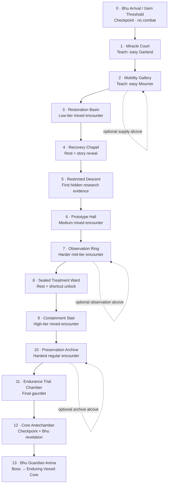

# Game 1 "Last Rite" — Bhu Level Design

> **Bhu demo level blueprint — 2026-08-28.** A compact, authored level that proves the Bhu story arc for Next Fest: miracle → compromise → Continuance → guardian.
>
> Companion to [[1k Last Rite - Lore Bible]] (fiction authority), [[1i Last Rite - Bhu Mani Husks]] (enemy family), and [[1l Last Rite - World & Environment Bible]] (world/environment rules). Where older Bhu planning disagrees, this document owns the Bhu demo’s room sequence and pacing.

---

## 1. Design intent

Bhu is a dense, room-by-room action level, not a few oversized scenic arenas. It contains many short, authored combat beats connected by compact transitions. The player should always understand the critical route, while small optional alcoves provide resources, story framing, and a brief alternate angle before returning to the same route.

The full Bhu arc has four macro-zones:

1. **Miracle Ward** — establishes why Bhu was beloved.
2. **Restricted Research Wing** — reveals the ethical compromise beneath its public medicine.
3. **Continuance Vault** — reveals Bhu’s post-Breach Husk research and its contribution to immortality.
4. **Bhu Guardian Arena** — earns the Enduring Vessel component.

### Room principles

- Build compact **duel rooms**, **mixed-encounter rooms**, and **breather rooms** rather than large empty environments.
- Mixed encounters draw from all three lesser families. They must still preserve the game’s readable, reaction-led attack scheduling; mixed does not mean simultaneous chaos.
- Teach a new variant safely in a duel room before it appears in a demanding mixed room.
- Exact room dimensions are a graybox decision: derive them from final player movement, enemy reach, and camera clearance rather than guessing fixed metres now.

---

## 2. Critical-path blueprint

The optional rooms must reconnect quickly to their origin. They are not major branches and must never bypass a story act or the boss.

---

## 3. Macro-zone beats

| Zone | Rooms | Story beat | Combat role | Environmental language |
|---|---:|---|---|---|
| Miracle Ward | 1–4 | Bhu genuinely healed bodies and was revered as a miracle institute. | Easy variants; safe family introductions; first low-tier mixed encounter. | Recovery courts, stepped pools, marigolds, mobility rails, cross-species treatment stations, warm earth-mani apparatus. |
| Restricted Research Wing | 5–8 | Healing became experimentation; patients became "continuing studies." | Medium variants; deliberate mixed encounters after safe introductions. | Prototype frames, observation galleries, hidden treatment rooms, sealed doors, apparatus with medical use becoming surveillance/control. |
| Continuance Vault | 9–12 | Post-Breach researchers studied non-decaying Husks to isolate Bhu’s contribution to immortality. | High-tier variants; the hardest regular combinations; final pre-boss gauntlet. | Preservation archives, containment shutters, abandoned human workstations, healing machinery repurposed for Husk study. |
| Guardian Arena | 13 | The Bhu guardian protects the lesson: the body can endure, but endurance alone is not life. | One dedicated boss duel. | Black stone, jade core, exact medical-crucible geometry, fourfold visual callbacks without becoming the Central Shrine. |

---

## 4. Room list

### 0. Bhu Arrival / Gem Threshold

**Purpose:** establish the separate Bhu realm and reset the player after teleportation.

**Gameplay:** checkpoint, no combat, a short approach that frames the first recovery court.

**Story:** the space looks cared for rather than hostile. It is the first evidence that Bhu was built to help people.

### 1. Miracle Court

**Purpose:** first safe duel.

**Gameplay:** easy Garland variant. Clear arena boundary and no competing threats.

**Story:** treatment plinths, restoration pools, and offerings show the public’s gratitude for Bhu medicine.

### 2. Mobility Gallery

**Purpose:** teach the next rhythm and offer a tiny optional supply loop.

**Gameplay:** easy Mourner variant. The side alcove carries a small reward, then immediately reconnects.

**Story:** rails, ramps, supports, and cross-species recovery equipment communicate movement rehabilitation.

### 3. Restoration Basin

**Purpose:** first low-tier mixed encounter.

**Gameplay:** all three lesser families may appear, but encounter direction gives one enemy the active timing role. The player demonstrates the reads learned in Rooms 1–2.

**Story:** the last openly beautiful public-treatment room; it should make the facility’s later fall hurt.

### 4. Recovery Chapel

**Purpose:** breather and first change in tone.

**Gameplay:** checkpoint/rest. No required combat.

**Story:** a restricted door, erased plaque, and a treatment route diverted underground imply that the visible miracle had a hidden cost.

### 5. Restricted Descent

**Purpose:** transition from public medicine to hidden research.

**Gameplay:** short traversal or a very light interruption, never a full encounter.

**Story:** patient routes become staff-only routes; doors begin locking from the human side.

### 6. Prototype Hall

**Purpose:** first medium-tier test.

**Gameplay:** medium variants in a compact mixed encounter. Introduce one new attack-deck rule in a safe opening before the full room escalates.

**Story:** restoration frames and prototype treatment apparatus show bodies being measured and standardized rather than simply healed.

### 7. Observation Ring

**Purpose:** harder mid-tier test and optional observation loop.

**Gameplay:** stronger mixed encounter, with readable sightlines from an upper gallery and a loop back to the main floor.

**Story:** observation windows, private galleries, and hidden records show that researchers watched patients who did not know they were studies.

### 8. Sealed Treatment Ward

**Purpose:** rest, checkpoint, and level compression.

**Gameplay:** rest room; open one compact shortcut that makes the Research Wing legible if the player must return.

**Story:** emergency shutters and abandoned human workstations mark the Breach as a sudden interruption.

### 9. Containment Stair

**Purpose:** declare the new stakes.

**Gameplay:** high-tier mixed encounter in a vertical compact room; this is a real challenge, not a tutorial.

**Story:** the player enters the Continuance Vault and sees that Bhu researchers held Husk bodies because they did not decay.

### 10. Preservation Archive

**Purpose:** hardest standard encounter.

**Gameplay:** high-tier variants, a strict active-attacker schedule, and only enough geometry to make positioning meaningful without hiding telegraphs.

**Story:** the facility’s healing tools have been repurposed into observation and preservation equipment. This is the ethical low point.

### 11. Endurance Trial Chamber

**Purpose:** final non-boss gauntlet.

**Gameplay:** a short sequence of escalating, authored combat beats. It tests the complete Bhu roster but should not become a long attrition room immediately before the boss.

**Story:** Bhu’s secret research question is clear: can an earthly body become an **Enduring Vessel** that never physically collapses?

### 12. Core Antechamber

**Purpose:** rest, checkpoint, and boss preparation.

**Gameplay:** no required combat. Boss door is in view.

**Story:** the player understands Bhu’s contribution to the wider Continuance cure: an enduring body is only one quarter of immortality.

### 13. Bhu Guardian Arena

**Purpose:** resolve Bhu’s local story.

**Gameplay:** a one-on-one boss duel. The guardian is a former nonhuman senior Bhu researcher or caretaker who still protects the work.

**Story reward:** extracting the guardian’s visible mani core is both a mercy-kill and the acquisition of the **Enduring Vessel** component for the Central Shrine’s Continuance Crucible.

---

## 5. Demo acceptance criteria

- A new player understands Bhu was once a beloved healing institute before reaching Room 4.
- A new player understands the ethical compromise before reaching Room 8.
- A new player understands Bhu’s role in the immortality cure before entering the boss arena.
- The player encounters all three lesser families in every macro-zone, with variant complexity rising by progression tier.
- The critical path has no bypass around the three story acts or the guardian.
- Optional content returns to the main path in minutes, not through a separate zone.
- No room is art-locked before player/camera/enemy metrics validate its combat readability.
