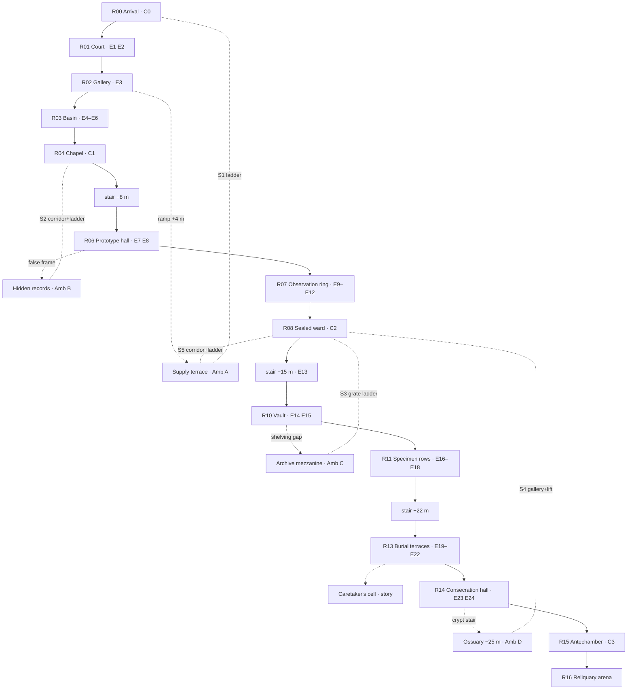

# Game 1 "Last Rite" — Bhu Greybox Layout

> **The Bhu demo level's spatial layout — 2026-08-28 (v3: 1.5× scale pass, compressed zone bands, shortened shortcuts).** This document owns the greybox: rooms, dimensions, elevations, encounter placement, checkpoints, and the shortcut web. Designed interactively (2D plan → 3D interactive map → Unity assembly → scale pass) in the 2026-08-28 session.
>
> **Authority.** Where this disagrees with [[1n Last Rite - Bhu Level Design]] §1 "Room principles" and §2's room sequence, **this document wins** (developer decision 2026-08-28): the level is a **linear critical path with optional side areas**, not the 14-room taxonomy. 1n's story acceptance criteria (§5) still apply and are honoured here. Companions: [[1i Last Rite - Bhu Mani Husks]] (enemy family), [[1l Last Rite - World & Environment Bible]] §3.1 (wing form), [[1m Last Rite - Story Treatment]] (realm story jobs).
>
> **Machine-readable twin:** `games/01-Last-Rite/ArtSource/Bhu/bhu_greybox_layout.json` — same data with world-metre coordinates; point tools and agents there.
> **Built scene:** `Assets/Scenes/Bhu Level.unity`, root `Bhu_Greybox` (ProBuilder meshes; zone-tinted materials in `Assets/Materials/Greybox/`). Scale reference: `REF_Player` (Player.prefab, **2.19 m tall**) stands at the arrival threshold.

---

## 1. Design rules

1. **Linear spine, four zones, one boss.** A → B → C → D → Reliquary. No bypass around story acts or the guardian.
2. **Fights happen in dedicated arenas.** Encounter markers are transition triggers, so the walkable level may freely use narrow galleries, stairs, and switchbacks.
3. **12 enemy variants** = Garland / Mourner / Deadfall × tiers T1–T4. **Every variant debuts safely** — solo, or beside an already-known partner — before appearing in packs (pacing law, [[1j Last Rite - Shroud, Mani & Sanity]] §6).
4. **The shortcut law.** Every zone has exactly one shortcut. It hides inside an optional area, is guarded by a one-time ambush (the ambush prices the shortcut), **unlocks only from the far side**, and is **permanently two-way** afterward, landing at the previous checkpoint. Shortcut travel is kept short: zone bands are compressed in plan so vertical links land almost directly.
5. **Movers are axis-honest.** Lifts and ladders travel strictly vertically; corridors and galleries strictly horizontally; only stairs and ramps slope.
6. **The return chain.** Ossuary → S4 → Sealed ward → S5 → Supply terrace → S1 → Arrival. The sealed ward (C2) is the hub of the web.
7. **Runback ≤ 60–90 s** from the nearest checkpoint anywhere in the level.
8. All dimensions are **greybox-provisional (I10)** — resized against player metrics, enemy reach, and camera clearance at playtest.

## 2. Zones

| Zone | Elev | Story beat | Combat tier |
|---|---|---|---|
| A · Miracle Ward | 0 m | Bhu genuinely healed; beloved public medicine | T1 |
| B · Restricted wing | −8 m | Healing became experimentation | T2 |
| C · Continuance vault | −15 m | Husk bodies studied for non-decay; ethical low point | T3 |
| D · Deep terraces | −22 m | Burial tier; funerary register; guardian approach | T4 elite |
| Boss | −22 m | The guardian protects the work; the kill completes its funeral | Reliquary, 3 phases |

The level enters high (the emerald threshold on the mountain face, per [[1l Last Rite - World & Environment Bible]] §3.1) and descends 0 → −25 m. Side elevations: supply terrace +4, archive mezzanine −11, ossuary −25. Plan footprint: X −44…+41 m, Z 0…105 m (entry south, boss north).

## 3. Rooms

Sizes in metres (width × depth). OPT = optional, LNK = connector, ST = stair.

| Room | Zone | Size | Elev | Contents |
|---|---|---|---|---|
| R00 Arrival threshold | A | 10.5×11.25 | 0 | **C0** · no combat · S1 ladder lands here |
| R01 Recovery court | A | 18.75×14.25 | 0 | E1, E2 · roofed by the supply terrace |
| R02 Rail gallery | A | 19.5×4.8 | 0 | E3 · narrow · ramp up to terrace |
| OPT Supply terrace | A | 39×6 | +4 | Amb A · cache · S1 head + S5 sealed hatch |
| R03 Restoration basin | A | 24.75×15.75 | 0 | E4, E5, E6 (zone exam) |
| R04 Recovery chapel | A | 12×11.25 | 0 | **C1** · breather · S2's barred door |
| ST Restricted descent | A→B | 6.75 w, 12 run | 0→−8 | no combat, tone shift (34°) |
| R06 Prototype hall | B | 27×18 | −8 | E7, E8 · false frame hides records entry |
| OPT Hidden records | B | 14.25×8.7 | −8 | Amb B · council files · S2 · tucked beneath the basin |
| R07 Observation ring | B | 21.75×20.25 | −8 | E9–E12 · ring around surveilled courtyard |
| R08 Sealed ward | B | 20.25×14.25 | −8 | **C2** · breather · **hub: S3 grate, S4 hoist, S5 shutter** |
| ST Containment stair | B→C | 6.75 w, 10 run | −8→−15 | **E13** stair duel (35°) |
| R10 Preservation vault | C | 33×18 | −15 | E14, E15 · shelving gap to mezzanine |
| OPT Archive mezzanine | C | 14.25×8.25 | −11 | Amb C · upgrade material · **directly beneath the ward** |
| R11 Specimen rows | C | 28.5×18.75 | −15 | E16, E17, E18 (vault exam) |
| ST Terrace stair | C→D | 8.25 w, 12 run | −15→−22 | no combat (30°) |
| R13 Burial terraces | D | 41.25×17.25 | −22 | E19–E22 · all three elites debut here |
| OPT Caretaker's cell | D | 13.5×8.25 | −22 | story only · guardian foreshadow |
| OPT Ossuary | D | 13.5×8.25 | −25 | Amb D · S4 coffin hoist · crypt stair from R14 |
| R14 Consecration hall | D | 21×15.75 | −22 | E23, E24 (final gauntlet) |
| R15 Core antechamber | D | 14.25×12.75 | −22 | **C3** · breather · boss door in view |
| R16 Reliquary arena | Boss | ⌀13.8 | −22 | boss duel · Enduring Vessel reward |

## 4. Shortcuts

All movers axis-honest: **lift/ladder = vertical, corridor/gallery = horizontal.**

| # | Route | Travel | Mechanism | Unlock (far side) |
|---|---|---|---|---|
| S1 | Supply terrace ↔ Arrival (C0) | 4 m ladder only | kick-down ladder | kick from the terrace |
| S2 | Hidden records ↔ Chapel (C1) | ~5 m corridor + 8 m ladder | hidden corridor + maintenance ladder | lift the door bar from behind |
| S3 | Archive mezzanine ↔ Sealed ward (C2) | 3 m ladder only | floor grate directly above the mezzanine | open the grate from below |
| S4 | Ossuary ↔ Sealed ward (C2) | ~33 m gallery + 17 m lift | coffin gallery at −25 + counterweight **hoist lift** | re-engage the counterweight in the crypt |
| S5 | Sealed ward ↔ Supply terrace | ~17 m corridor + 12 m ladder | Breach-era evacuation corridor + terrace hatch | force the emergency shutter in the ward |

## 5. Encounters (24 mainline + 4 ambushes + boss)

| Zone | Debuts | Packs | Ambush |
|---|---|---|---|
| A | E1 G1 · E3 M1 · E5 D1 | E2 G1×2 · E4 G1+M1 · E6 G1+M1+D1 | A: M1×2 |
| B | E7 G2 · E9 M2+G1 · E10 D2 | E8 G2+M1 · E11 G2+D2 · E12 M2+D2+G1 | B: D2+M1 |
| C | E13 G3 · E14 M3+G2 · E16 D3 | E15 G3+M3 · E17 D3+M2+G2 · E18 G3+M3+D3 | C: G3×2 |
| D | E19 G4 · E20 M4+G3 · E21 D4 | E22 G4+D4 · E23 M4+D4+G3 · E24 G4+M4+D4 | D: D4+M3 |

G = Garland (metronome), M = Mourner (off-beat), D = Deadfall (liar), per [[1i Last Rite - Bhu Mani Husks]]. Rotation-order authoring and the economy war (parry = AP faucet, dodge-only = drain) follow 1i §6.

## 6. Flow

Dashed unlabeled edges are optional-area entries; dashed S-edges are the two-way shortcuts.

## 7. Coordinate convention

All coordinates are **Unity world metres**, stored directly in the JSON twin (`center = [x, elev, z]`, `size = [width, depth]`). Entry at Z≈2 (south), boss arena at Z≈98 (north); X spans −44…+41. Elevation Y is the walking surface. The v3 pass multiplied v1 footprints ×1.5 and compressed the dead space between zone bands, which is what shortened the shortcut runs.

## 8. Open items

- All dimensions, encounter compositions, and ambush difficulty: playtest-open (I10).
- Arena designs for the 29 fight transitions — separate pass; E13's arena should be a vertical stair variant.
- Whether S4's hoist gets a second stop at the antechamber (C3) for post-clear traversal.
- Whether shortcut ambushes respawn (current assumption: one-time).
- [[1n Last Rite - Bhu Level Design]] needs its supersede note added in a reconciliation pass (not yet edited).
- Walls, doorway framing, and blocking volumes — next greybox pass; current scene is floors, stairs, and shortcut geometry only. Floors are single-sided planes (invisible from below); extrude to slabs if that bothers in-editor review.
