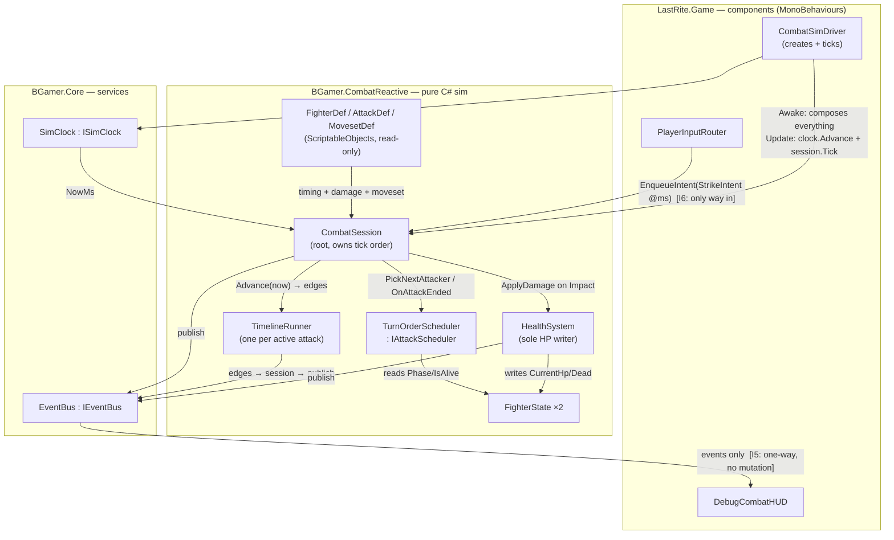
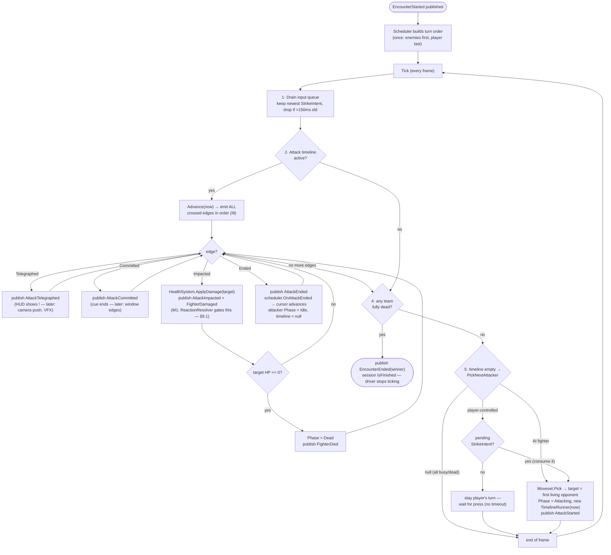
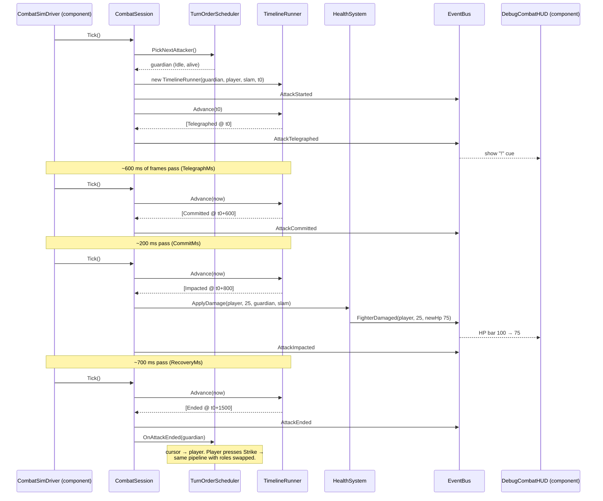

# Game 1 "Last Rite" — Combat Core Spec (v0 slice)

> **Implementation-level spec for the FIRST combat slice — written 2026-06-12, before any code.** Child of [[1a Last Rite - Code Architecture]] (the authoritative architecture; its seams and guardrails all apply). This doc is deliberately self-contained and explicit so it can be handed to an implementing engineer or AI model with no other context.
>
> **v0 scope:** two fighters · turn-order scheduling · one attack per fighter · damage · death · debug HUD. **NOT in v0 (but every attachment point is specified in §9):** parry/dodge windows + reaction resolver, purge meter, camera, animation, projectiles, feints, remix.

---

## 0. Terminology & the laws (read first)

**Vocabulary:** "**component**" in this project always means a **MonoBehaviour class** on a GameObject. Pure-C# objects are called "classes" or "sim objects." "**Def**" = a ScriptableObject holding authored data. "**State**" = a plain runtime class instance.

**The invariants (numbered — violating any of these is a bug, not a style choice):**

- **I1 — The sim is pure C#.** No class inside `BGamer.CombatReactive` may derive from `MonoBehaviour`, reference `UnityEngine.Time`, `Update()`, coroutines, or scene objects. (ScriptableObject Defs are the only Unity types allowed, as data carriers.)
- **I2 — All timing reads the sim clock.** Every duration, timestamp, and window is in **milliseconds of `ISimClock` time**. `Time.time` / `Time.deltaTime` never appear in sim code.
- **I3 — Data is truth; animation is fitted to data.** Attack timing lives in `AttackDef` fields. Animation playback rate is later stretched to match the data — never the reverse. Gameplay timing must never be authored inside animation clips or anim events. (Anim events are allowed for pure cosmetics only — footsteps, dust.)
- **I4 — Per-attack timing.** Every attack carries its own full timing block. There is no global "standard window" that pretends to fit all animations.
- **I5 — Events flow outward only.** Sim facts leave via `IEventBus` publishes. No subscriber (HUD, VFX, audio, future purge system) may mutate sim state. There is no API surface for it.
- **I6 — Input flows inward only, timestamped.** The only way to influence the sim is a timestamped intent entering through `CombatSession.EnqueueIntent`. Presentation never calls sim methods directly.
- **I7 — Deterministic tick order.** `CombatSession.Tick()` executes its steps in the exact order of §6. Never reorder.
- **I8 — A skipped frame skips nothing.** If a slow frame jumps the clock past several phase edges, `TimelineRunner.Advance` must emit **all** crossed edges, in chronological order, in that one call.
- **I9 — Events are immutable structs.** Every event type is a `readonly struct` carrying ids and values, never live object references that invite mutation.
- **I10 — All reference numbers are playtest-open.** HP, damage, durations in this doc are placeholders to make the slice runnable, not design.

---

## 1. Where everything lives

Assemblies per [[1a Last Rite - Code Architecture]] §1 (asmdefs created at scaffold):

| Class / file | Assembly | Folder |
|---|---|---|
| `ISimClock`, `SimClock`, `ManualClock` | BGamer.Core | `Assets/Code/BGamer.Core/Time/` |
| `IEventBus`, `EventBus` | BGamer.Core | `Assets/Code/BGamer.Core/Events/` |
| `FighterDef`, `AttackDef`, `MovesetDef` | BGamer.CombatReactive | `Assets/Code/BGamer.CombatReactive/Data/` |
| `FighterState`, `Team`, `FighterPhase` | BGamer.CombatReactive | `Assets/Code/BGamer.CombatReactive/Runtime/` |
| `HealthSystem` | BGamer.CombatReactive | `Assets/Code/BGamer.CombatReactive/Runtime/` |
| `TimelineRunner`, `AttackPhase` | BGamer.CombatReactive | `Assets/Code/BGamer.CombatReactive/Runtime/` |
| `IAttackScheduler`, `TurnOrderScheduler` | BGamer.CombatReactive | `Assets/Code/BGamer.CombatReactive/Scheduling/` |
| `CombatSession`, `FighterSpawn`, `StrikeIntent` | BGamer.CombatReactive | `Assets/Code/BGamer.CombatReactive/Runtime/` |
| Combat event structs | BGamer.CombatReactive | `Assets/Code/BGamer.CombatReactive/Events/` |
| `CombatSimDriver` (component) | LastRite.Game | `Assets/Code/LastRite.Game/Combat/` |
| `PlayerInputRouter` (component) | LastRite.Game | `Assets/Code/LastRite.Game/Combat/` |
| `DebugCombatHUD` (component) | LastRite.Game | `Assets/Code/LastRite.Game/Combat/` |
| EditMode tests | Tests asm | `Assets/Code/Tests/CombatReactive.Tests/` |

Asmdef references: `LastRite.Game → BGamer.CombatReactive → BGamer.Core`. `BGamer.*` must have **zero** references to `LastRite.*` (CI-checkable extraction rule).

---

## 2. Type-design policy (interface vs class vs SO)

Rule: **an interface exists only when a second implementation can be named today** (a test fake counts only if the real thing is awkward in tests). Data = ScriptableObjects. Logic = concrete classes. Inheritance ≈ never.

| Piece | Kind | The nameable second implementation |
|---|---|---|
| Clock | `ISimClock` → `SimClock`, `ManualClock` | `ManualClock` is hand-cranked in tests |
| Event bus | `IEventBus` → `EventBus` | recording spy-bus in tests |
| Scheduler | `IAttackScheduler` → `TurnOrderScheduler` | LS `TurnBasedScheduler` (locked); gray-box A/B policies |
| Damage steps *(M1+)* | `IDamageStep` chain | G1 registers OpeningMult/CounterCrit; LS registers Flank/Crit |
| HealthSystem | **concrete class — NO interface** | none nameable; per-game variability lives in `IDamageStep`, not here |
| TimelineRunner | concrete class | none — it is the single timing truth |
| CombatSession | concrete class | none — one composition root per fight |
| Defs | ScriptableObjects | data has no behavior to abstract |
| FighterState | plain class | pure composition |

---

## 3. Data types (ScriptableObjects + runtime state)

### 3.1 `AttackDef` (ScriptableObject) — one attack as data

```csharp
[CreateAssetMenu(menuName = "LastRite/Combat/AttackDef")]
public sealed class AttackDef : ScriptableObject
{
    public string Id;            // stable string id, e.g. "guardian.slam" (saves/logs use this, never asset refs)
    public string DisplayName;

    [Header("Timing (ms, sim clock) — I3/I4: THIS is the truth, anim is fitted to it")]
    public int TelegraphMs;      // readable wind-up; the parry cue window lives inside this later
    public int CommitMs;         // attack travels; uninterruptible. Impact fires at the END of commit.
    public int RecoveryMs;       // attacker is exposed; later = the punish/counter window

    [Header("Payload")]
    public int Damage;           // flat deterministic damage (I10: reference number)

    // M1+ fields (declared here so v0 code reserves no conflicting names):
    // ReadType readType;                    // Parryable | Perilous | Ranged
    // int parryWindowMs, perfectWindowMs;   // per-attack overrides of ReactionTuningDef
    // string behaviorId;                    // behavior-registry hook for new verbs
    // ShotDef cameraShotHint; TelegraphCueDef cue;
}
```

Attack lifecycle on the clock (`t0` = start):

```
t0 ──────────────► t0+Telegraph ─────► t0+Telegraph+Commit ──────► +Recovery ──► done
   TELEGRAPH            COMMIT           ▲ IMPACT (instant:           RECOVERY
   (cue visible,        (committed,        damage applies here)      (exposed)
    reactable later)     unstoppable)
```

### 3.2 `MovesetDef` (ScriptableObject)

```csharp
public sealed class MovesetDef : ScriptableObject
{
    public AttackDef[] Attacks;                       // v0: exactly one entry
    public AttackDef Pick(IRng rng) => Attacks[0];    // v0: first. Later: weighted strings + policy.
}
```

### 3.3 `FighterDef` (ScriptableObject)

```csharp
public sealed class FighterDef : ScriptableObject
{
    public string Id;            // "player.purifier", "guardian.husk_amphibian"
    public string DisplayName;
    public int MaxHp;            // reference: player 100, guardian 60
    public MovesetDef Moveset;
}
```

### 3.4 Runtime state (plain classes/enums — never SOs)

```csharp
public enum Team { Player, Enemy }

public enum FighterPhase { Idle, Attacking, Recovering, Staggered, Dead }
// v0 uses Idle / Attacking / Dead. Recovering & Staggered are reserved (scheduler already skips them).

public sealed class FighterState
{
    public FighterDef Def;            // read-only data
    public Team Team;
    public bool IsPlayerControlled;
    public int CurrentHp;             // HealthSystem is the ONLY writer
    public FighterPhase Phase;
    public bool IsAlive => Phase != FighterPhase.Dead;
}

public readonly struct FighterSpawn   // session constructor input
{
    public readonly FighterDef Def; public readonly Team Team; public readonly bool IsPlayerControlled;
}

public readonly struct StrikeIntent   // the ONLY v0 input (I6)
{
    public readonly long PressedAtMs;  // stamped by the input component from ISimClock at press time
}
```

---

## 4. Core services (BGamer.Core)

### 4.1 Clock

```csharp
public interface ISimClock { long NowMs { get; } }

public sealed class SimClock : ISimClock
{
    // Advanced once per frame by CombatSimDriver: Advance(Time.deltaTime).
    // Accumulates double seconds → exposes long milliseconds.
    public void Advance(float deltaSeconds);
    public long NowMs { get; }
    // M1+: Hitstop(ms), timescale — implemented HERE so frozen time freezes windows + input grading together.
}

public sealed class ManualClock : ISimClock   // tests only
{
    public long NowMs { get; private set; }
    public void Set(long ms); public void AdvanceMs(long ms);
}
```

### 4.2 Event bus

```csharp
public interface IEventBus
{
    void Subscribe<T>(Action<T> handler) where T : struct;
    void Unsubscribe<T>(Action<T> handler) where T : struct;
    void Publish<T>(in T evt) where T : struct;
}
```

Implementation notes for `EventBus`: `Dictionary<Type, List<Delegate>>`; **synchronous** dispatch in subscribe order; `Publish` iterates a **snapshot copy** of the handler list so a handler may safely subscribe/unsubscribe during dispatch; no queuing (single-threaded sim).

---

## 5. The event vocabulary (v0)

All `readonly struct`, all carrying **ids/values only** (I9). `long AtMs` = sim time of the fact (for edges crossed mid-frame, the *scheduled* edge time, not the tick time).

| Event | Payload | Published by | Meaning / v0 consumer |
|---|---|---|---|
| `EncounterStarted` | fighter ids, teams | CombatSession | HUD builds bars |
| `AttackStarted` | attackerId, targetId, attackId, AtMs | CombatSession | log line |
| `AttackTelegraphed` | attackerId, attackId, AtMs | TimelineRunner | HUD shows "!" cue *(later: camera push, telegraph VFX/SFX)* |
| `AttackCommitted` | attackerId, attackId, AtMs | TimelineRunner | cue ends *(later: parry window edges live here)* |
| `AttackImpacted` | attackerId, targetId, attackId, AtMs | TimelineRunner (via session) | the damage moment |
| `FighterDamaged` | targetId, sourceId, attackId, amount, newHp, AtMs | HealthSystem | HUD updates HP bar |
| `FighterDied` | fighterId, AtMs | HealthSystem | HUD strikethrough; session checks end |
| `AttackEnded` | attackerId, attackId, AtMs | TimelineRunner (via session) | turn passes |
| `EncounterEnded` | winningTeam, AtMs | CombatSession | HUD shows VICTORY / DEATH |

Reserved for M1+ (do not repurpose these names): `WindowOpened/WindowClosed(type)`, `ReactionResolved(outcome)`, `FighterStaggered`, `ProjectileSpawned/Deflected`.

---

## 6. `CombatSession` — the root, and the tick law (I7)

```csharp
public sealed class CombatSession
{
    public CombatSession(IReadOnlyList<FighterSpawn> spawns, IAttackScheduler scheduler,
                         IEventBus bus, ISimClock clock);
    public void EnqueueIntent(in StrikeIntent intent);   // thread: main only
    public void Tick();                                  // call once per frame
    public bool IsFinished { get; }
    public Team? WinningTeam { get; }
}
```

`Tick()` steps — **exactly this order, every frame**:

```
1. now = clock.NowMs
2. DRAIN INPUT  — move queued StrikeIntents into _pendingStrike (keep only the newest;
                  discard if older than now - 150ms — the strike buffer).
                  NOTE (M1): parry intents will NOT be buffered. Buffering policy is per-intent-type.
3. ADVANCE TIMELINE — if _activeTimeline != null:
       foreach edge in _activeTimeline.Advance(now):      // ALL crossed edges, in order (I8)
           Telegraphed → publish AttackTelegraphed
           Committed   → publish AttackCommitted
           Impacted    → publish AttackImpacted
                         health.ApplyDamage(target, attack.Damage, attacker, attack, edgeAtMs)
                         // M1: the ReactionResolver gates/modifies this call. THE seam. See §9.1.
           Ended       → publish AttackEnded
                         scheduler.OnAttackEnded(attacker)
                         attacker.Phase = Idle
                         _activeTimeline = null
4. CHECK END — if either team has no living fighters:
       IsFinished = true; publish EncounterEnded(winner); return (no further scheduling).
5. SCHEDULE — if _activeTimeline == null and !IsFinished:
       attacker = scheduler.PickNextAttacker()
       if attacker == null: return
       if attacker.IsPlayerControlled and _pendingStrike == null: return   // wait — it stays
           // the player's turn until they press Strike. No timeout in v0.
       if attacker.IsPlayerControlled: consume _pendingStrike
       attack = attacker.Def.Moveset.Pick(rng)
       target = first living fighter on the opposite team
       attacker.Phase = Attacking
       _activeTimeline = new TimelineRunner(attacker, target, attack, startMs: now)
       publish AttackStarted
```

Edge cases (decided, not open): a `StrikeIntent` arriving when it is not the player's turn is kept only within the 150 ms buffer, then discarded silently. Damage to an already-dead fighter is ignored (`HealthSystem` guard). The session never restarts — host creates a new `CombatSession` per encounter (respawn = new session).

---

## 7. The remaining sim classes

### 7.1 `TimelineRunner`

```csharp
public enum AttackPhase { Telegraph, Commit, Recovery, Done }

public sealed class TimelineRunner
{
    public TimelineRunner(FighterState attacker, FighterState target, AttackDef attack, long startMs);
    public FighterState Attacker { get; } public FighterState Target { get; } public AttackDef Attack { get; }

    // Returns every edge whose scheduled time <= nowMs and not yet emitted, in chronological
    // order (I8). Edge times: Telegraphed = startMs (emitted on first Advance call),
    // Committed = startMs + TelegraphMs, Impacted = +CommitMs, Ended = +RecoveryMs.
    public IReadOnlyList<TimelineEdge> Advance(long nowMs);
}

public readonly struct TimelineEdge { public readonly EdgeKind Kind; public readonly long AtMs; }
public enum EdgeKind { Telegraphed, Committed, Impacted, Ended }
```

The runner knows **one attack and the clock** — never HP, never the other fighters, never who wins (see the knowledge table §10).

### 7.2 `HealthSystem`

```csharp
public sealed class HealthSystem
{
    public HealthSystem(IEventBus bus);
    // The ONLY method in the codebase that writes CurrentHp or sets Phase = Dead.
    public void ApplyDamage(FighterState target, int amount, FighterState source, AttackDef attack, long atMs)
    {
        if (!target.IsAlive) return;                       // dead take no damage, Died fires once
        target.CurrentHp = Math.Max(0, target.CurrentHp - amount);
        publish FighterDamaged(...);
        if (target.CurrentHp == 0) { target.Phase = FighterPhase.Dead; publish FighterDied(...); }
    }
    // M1: signature grows a ReactionOutcome parameter + IDamageStep pipeline runs before the subtract.
}
```

### 7.3 Scheduler

```csharp
public interface IAttackScheduler
{
    void OnEncounterStart(IReadOnlyList<FighterState> fighters);
    FighterState PickNextAttacker();        // null = nobody may act this tick
    void OnAttackEnded(FighterState attacker);
}

public sealed class TurnOrderScheduler : IAttackScheduler
{
    // Turn order is built ONCE at encounter start and then only rotated:
    // last attacker → next in order. Everyone on the team opposite the
    // current attacker is a defender (v0: the single target; M1: reaction
    // windows are graded against the targeted defender's inputs).
    private List<FighterState> _order;   // v0 build rule: enemies first, then player
    private int _cursor;

    OnEncounterStart: _order = fighters (enemies first, player last); _cursor = 0;
    PickNextAttacker:
        scan from _cursor for the first fighter with Phase == Idle && IsAlive
        (skip Dead — they leave the rotation; skip Staggered — they lose the slot);
        return it, or null if none.
    OnAttackEnded(attacker): _cursor = (indexOf(attacker) + 1) % _order.Count;
}
```

*(Parked for gray-box A/B, zero structural cost: strict rotation for the player vs "enemies rotate, player strikes freely into recovery" — that is just a different `IAttackScheduler`.)*

### 7.4 Components (LastRite.Game — the only MonoBehaviours)

- **`CombatSimDriver`** — owns the composition: creates `SimClock`, `EventBus`, `HealthSystem`, `TurnOrderScheduler`, `CombatSession` in `Awake` from two `FighterDef` inspector slots; `Update()` = `clock.Advance(Time.deltaTime); session.Tick();`. Stops ticking when `IsFinished`.
- **`PlayerInputRouter`** — polls the Input System for the Strike action (v0: Space / pad X); on press calls `session.EnqueueIntent(new StrikeIntent(clock.NowMs))`. *(Replaced by `IInputService` at M0-full; parry presses will be stamped the same way but never buffered.)*
- **`DebugCombatHUD`** — subscribes to all §5 events; IMGUI/UIToolkit text: two HP bars, current attack phase, "!" during Telegraph, event log, VICTORY/DEATH banner. **Subscribes only — no sim references beyond the subscribe call (I5).**

---

## 8. Diagrams

### 8.1 Connections — who talks to whom



### 8.2 Fight logic — one full encounter



### 8.3 One guardian attack, end to end (sequence)



---

## 9. Attachment points for M1+ (do NOT design these now, do NOT block them either)

1. **ReactionResolver (the big one):** slots **between the `Impacted` edge and `HealthSystem.ApplyDamage`** in Tick step 3. It will take the attack's window data + the defender's timestamped reaction inputs and return a `ReactionOutcome` (Perfect/Block/Dodged/FeintBaited/Hit) that decides whether/how much damage applies. v0's direct `ApplyDamage` call is explicitly the placeholder for this.
2. **Windows & cues:** `AttackDef` gains per-attack window fields; `TimelineRunner` emits `WindowOpened/Closed` edges computed from them. The VFX/SFX parry cue subscribes to the SAME edges the resolver grades — cue and window can never disagree.
3. **Window authoring tool (editor, M1):** scrub the attack animation in a preview, click to mark telegraph/impact moments → tool writes the ms values INTO the `AttackDef`. Authoring feels frame-based; data stays the truth (I3).
4. **Purge economy:** a `LastRite.Game` subscriber on `ReactionResolved` — never inside CombatReactive.
5. **Hitstop/feel:** implemented inside `SimClock` so frozen time freezes timelines and input stamping together.
6. **Camera/animation:** subscribers on `AttackTelegraphed`/`AttackImpacted`; the anim component fits clip playback rate to `AttackDef` durations (I3).
7. **Buffering policy:** step 2 of the tick is per-intent-type — Strike/Dodge buffered 150 ms, **Parry never buffered** (press-time graded).

---

## 10. Knowledge table (what each class is allowed to know)

| Class | Knows | Must NEVER know |
|---|---|---|
| TimelineRunner | its one AttackDef, the clock, its two fighter refs | HP values, win conditions, other timelines, Unity |
| HealthSystem | FighterState + bus | who scheduled the attack, timing, turns |
| TurnOrderScheduler | fighter phases/teams | timing internals, damage, HP math |
| MovesetDef | its own AttackDefs | scheduling, health, the opponent |
| CombatSession | all sim objects + clock + bus | Unity, rendering, input devices, purge/economy |
| Components (driver/input/HUD) | session boundary API + events | sim internals (no reaching into FighterState to write) |

If an implementation step requires violating a cell of this table, stop — the design is being broken, re-read §0.

---

## 11. EditMode test list (write these WITH the code, ManualClock + spy bus)

**HealthSystem**
- T1: 100 HP − 25 → 75; `FighterDamaged{amount:25,newHp:75}` published once.
- T2: 20 HP − 25 → 0 (clamped); `FighterDamaged` then `FighterDied`, in that order.
- T3: damage on a Dead fighter → no event, no HP change; `FighterDied` never fires twice.

**TimelineRunner** (attack: Telegraph 600 / Commit 200 / Recovery 700, start t0=1000)
- T4: Advance(1000) → [Telegraphed@1000]; Advance(1599) → []; Advance(1600) → [Committed@1600]; Advance(1800) → [Impacted@1800]; Advance(2500) → [Ended@2500].
- T5 (I8): Advance(1000) then Advance(9999) → [Committed@1600, Impacted@1800, Ended@2500] — all three, in order, with **scheduled** times.

**TurnOrderScheduler** (guardian + player)
- T6: order = [guardian, player]; picks guardian; OnAttackEnded → picks player; → guardian again.
- T7: guardian Dead → only player is ever picked; both dead/busy → null.

**CombatSession integration** (guardian 60 HP / dmg 25 vs player 100 HP / dmg 10, scripted intents)
- T8: full scripted fight — player needs 6 strikes; guardian lands 25×N between them; assert exact event sequence ends `FighterDied(guardian)` → `EncounterEnded(Player)` and session stops scheduling after.
- T9: StrikeIntent stamped 200 ms before the player's turn starts → discarded (buffer 150); intent stamped 100 ms before → consumed, attack starts.
- T10: no intent → clock advances 10 s → still the player's turn, no attack started, nothing crashed.

**Definition of done (v0):** all tests green · a scene with two capsules + `CombatSimDriver` + HUD where the guardian auto-attacks, Space strikes back, someone dies, banner shows · zero MonoBehaviours in `BGamer.*` · asmdef references exactly as §1.

---

## 12. Decisions recorded in this pass (2026-06-12, chat session)

- **D-c1 — Anim-frame events as gameplay truth: REJECTED; data-is-truth REAFFIRMED** (1a §3.5 stands). The legitimate need behind it (per-attack windows that match each animation + event-driven cues) is satisfied by per-attack `AttackDef` timing + `TimelineRunner` edge events. Mitigation for authoring ergonomics: the **scrub-to-author editor tool** (§9.3). Rationale: AI-generated (Kimodo) clips must be regenerable without gameplay drift; Unity anim events are skippable on transition interrupts; the fairness validator can only audit data; hitstop-as-clock-op needs one time authority.
- **D-c2 — v0 scheduling = explicit turn order** (`TurnOrderScheduler`): order built once at encounter start, rotates last-attacker → next; opposite team = defenders. The aggression-token policy and the "player strikes freely into recovery" variant remain `IAttackScheduler` implementations to A/B in the gray-box.
- **D-c3 — Interface policy:** interface only with a nameable second implementation (test fakes count only when the real thing is test-awkward). HealthSystem stays concrete; the seams are `ISimClock`, `IEventBus`, `IAttackScheduler`, later `IDamageStep`/`IInputService`/`IAttackBehavior`.
- **D-c4 — Vocabulary:** "component" = MonoBehaviour. Sim = pure C# classes; components exist only at the boundary (driver, input router, HUD).
