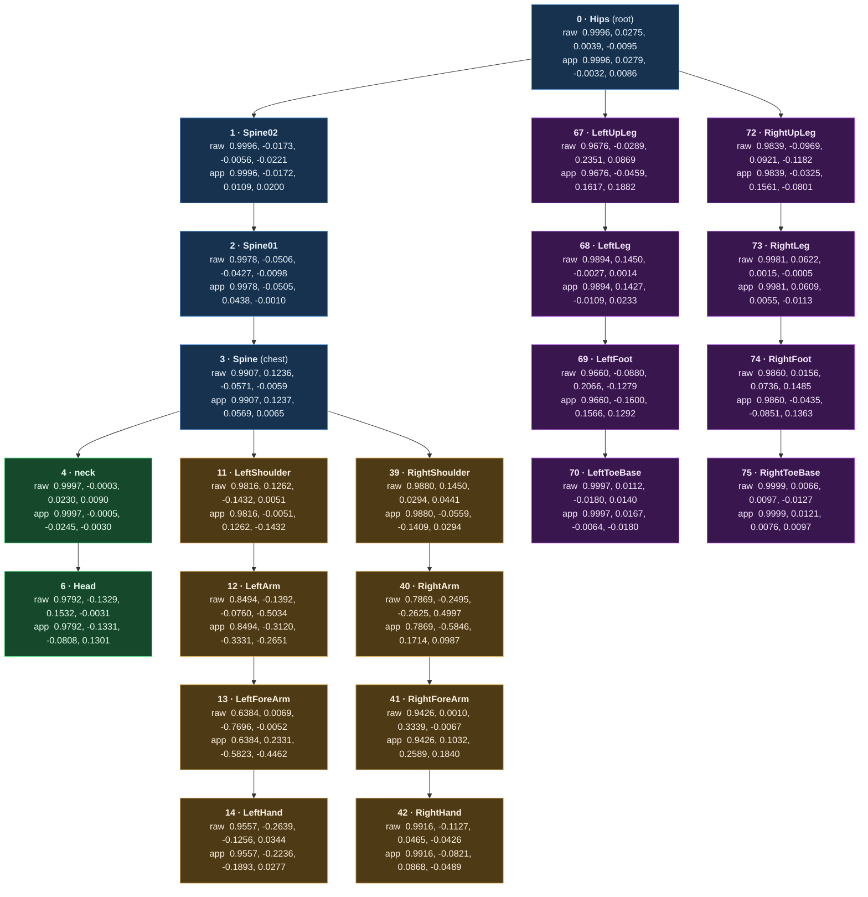

# SOMA → Meshy Retarget Map

> How a Kimodo **SOMA** animation (77-joint, index-addressed, Y-up) becomes pose data on a Meshy **Mixamo** rig (24-bone, name-addressed, Z-up). The bone map + the per-frame transform that bridges them. Part of [[00 Tools Hub]] · companion to [[01 AssetForge]] (where the map lives in code) and [[02 Prompting & Motion Quality]]. Last updated 2026-06-15.

---

## The two storage formats

**Kimodo / SOMA** — flat, **index**-addressed, **parent**-relative, **Y-up**:

```python
npz = {
  "local_rot_mats" : float32[F, 77, 3, 3],   # F frames × 77 joints × 3×3 rotation
  "root_positions" : float32[F, 3],          # root world translation, per frame
  "global_rot_mats": float32[F, 77, 3, 3],   # same joints, world-space (also provided)
}
# A bone IS an integer index 0..76 (order = SOMASkeleton77.bone_order_names).
# Parent topology is a FIXED table, not stored per frame.
# Value = the joint's LOCAL rotation relative to its parent, raw 3×3.
```

**Meshy (Blender)** — **name**-addressed hierarchy, quaternion **basis vs rest**, **Z-up**:

```python
armature.bones = { "Hips": Bone(parent=None, matrix_local=4×4 rest), ... }   # by NAME
action.fcurves = [ FCurve('pose.bones["LeftArm"].rotation_quaternion', index=0..3), ... ]
# Value = pose_bone.rotation_quaternion: local rotation RELATIVE TO ITS REST frame
#         (rest = bone.matrix_local). One keyframe per frame.
```

## The bridge (per joint, per frame)

```python
W = Rx(-90°)                                   # Y-up (Kimodo) → Z-up (Blender)
for (soma_idx, bone_name) in SOMA_TO_MIXAMO:   # 22 of 77 joints are used
    R     = local_rot_mats[frame, soma_idx]                     # raw 3×3 (Kimodo)
    A     = armature.bones[bone_name].matrix_local.to_3x3()     # Meshy rest orientation
    basis = Aᵀ · (W · R · Wᵀ) · A                               # re-express in bone's rest frame
    pose_bones[bone_name].rotation_quaternion = quat(basis)     # keyframe at frame+1
```

This is a **similarity transform**: it preserves the rotation **angle** (the quaternion scalar `w`) and only re-expresses the **axis** `(x,y,z)` into each bone's own rest frame. Source of truth in code: `SOMA_TO_MIXAMO` + `npz_to_blender_action()` in `tools/assetforge/assetforge/core/backends/kimodo/kimodo.py`.

---

## Chart — skeleton tree with indices + frame-1 values

Each node: **SOMA index · bone name**, then the **raw** Kimodo quaternion `[w,x,y,z]` over the **app**lied Meshy basis. Edges are the FK parent chain. Sample data = frame 1 of `kimodo_local_test.npz`.



## Mapping table (`SOMA_TO_MIXAMO`)

| SOMA idx | Meshy bone | raw `[w,x,y,z]` (Kimodo) | applied `[w,x,y,z]` (Meshy basis) |
|---|---|---|---|
| 0 | Hips | 0.9996, 0.0275, 0.0039, -0.0095 | 0.9996, 0.0279, -0.0032, 0.0086 |
| 1 | Spine02 | 0.9996, -0.0173, -0.0056, -0.0221 | 0.9996, -0.0172, 0.0109, 0.0200 |
| 2 | Spine01 | 0.9978, -0.0506, -0.0427, -0.0098 | 0.9978, -0.0505, 0.0438, -0.0010 |
| 3 | Spine (chest) | 0.9907, 0.1236, -0.0571, -0.0059 | 0.9907, 0.1237, 0.0569, 0.0065 |
| 4 | neck | 0.9997, -0.0003, 0.0230, 0.0090 | 0.9997, -0.0005, -0.0245, -0.0030 |
| 6 | Head | 0.9792, -0.1329, 0.1532, -0.0031 | 0.9792, -0.1331, -0.0808, 0.1301 |
| 11 | LeftShoulder | 0.9816, 0.1262, -0.1432, 0.0051 | 0.9816, -0.0051, 0.1262, -0.1432 |
| 12 | LeftArm | 0.8494, -0.1392, -0.0760, -0.5034 | 0.8494, -0.3120, -0.3331, -0.2651 |
| 13 | LeftForeArm | 0.6384, 0.0069, -0.7696, -0.0052 | 0.6384, 0.2331, -0.5823, -0.4462 |
| 14 | LeftHand | 0.9557, -0.2639, -0.1256, 0.0344 | 0.9557, -0.2236, -0.1893, 0.0277 |
| 39 | RightShoulder | 0.9880, 0.1450, 0.0294, 0.0441 | 0.9880, -0.0559, -0.1409, 0.0294 |
| 40 | RightArm | 0.7869, -0.2495, -0.2625, 0.4997 | 0.7869, -0.5846, 0.1714, 0.0987 |
| 41 | RightForeArm | 0.9426, 0.0010, 0.3339, -0.0067 | 0.9426, 0.1032, 0.2589, 0.1840 |
| 42 | RightHand | 0.9916, -0.1127, 0.0465, -0.0426 | 0.9916, -0.0821, 0.0868, -0.0489 |
| 67 | LeftUpLeg | 0.9676, -0.0289, 0.2351, 0.0869 | 0.9676, -0.0459, 0.1617, 0.1882 |
| 68 | LeftLeg | 0.9894, 0.1450, -0.0027, 0.0014 | 0.9894, 0.1427, -0.0109, 0.0233 |
| 69 | LeftFoot | 0.9660, -0.0880, 0.2066, -0.1279 | 0.9660, -0.1600, 0.1566, 0.1292 |
| 70 | LeftToeBase | 0.9997, 0.0112, -0.0180, 0.0140 | 0.9997, 0.0167, -0.0064, -0.0180 |
| 72 | RightUpLeg | 0.9839, -0.0969, 0.0921, -0.1182 | 0.9839, -0.0325, 0.1561, -0.0801 |
| 73 | RightLeg | 0.9981, 0.0622, 0.0015, -0.0005 | 0.9981, 0.0609, 0.0055, -0.0113 |
| 74 | RightFoot | 0.9860, 0.0156, 0.0736, 0.1485 | 0.9860, -0.0435, -0.0851, 0.1363 |
| 75 | RightToeBase | 0.9999, 0.0066, 0.0097, -0.0127 | 0.9999, 0.0121, 0.0076, 0.0097 |

## Reading notes

- **`w` is identical raw vs applied in every row** — the retarget rotates the *axis*, not the *angle*. The bigger a bone's rest tilt vs SOMA, the more `(x,y,z)` shifts (compare `Hips`, barely moved, to `LeftArm`/`RightArm`, heavily remapped).
- **22 of 77 joints map.** Skipped SOMA indices: `5` (Neck2), `7–10` (HeadEnd/Jaw/eyes), `15–38` (left fingers), `43–66` (right fingers), `71`/`76` (toe-ends) — the [[1b Last Rite - Art Bible|Art Bible]] rig has no bones for those (no fingers, no facial micro-rig).
- **Spine is reverse-numbered** in the Meshy rig: `Spine02` is the bottom vertebra (parent = Hips), `Spine` is the chest (parent of shoulders + neck). The FK chain is still `Hips → Spine02 → Spine01 → Spine`.
- **Why the conjugation by `A`** (not a raw copy): the Meshy auto-rig gives each bone an arbitrary rest orientation, so the same SOMA rotation must be re-expressed per bone. Matching rest orientations alone is *not* enough to skip the retarget — the mesh is bound in the A-pose, not SOMA's rest pose (tested 2026-06-15: raw application bends the mesh).
